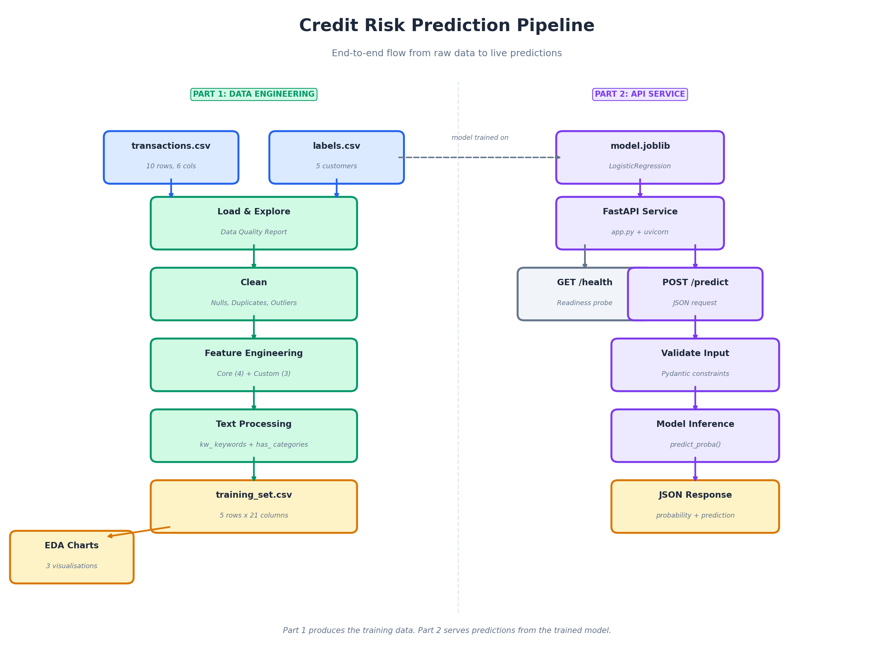
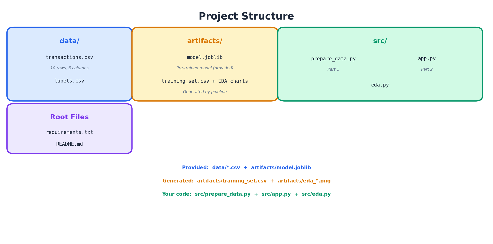
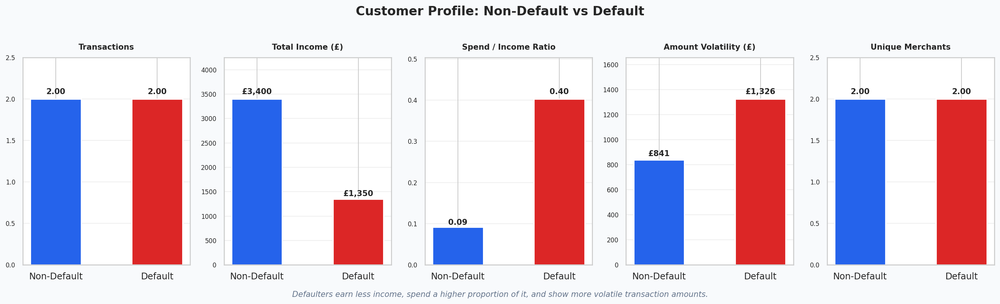
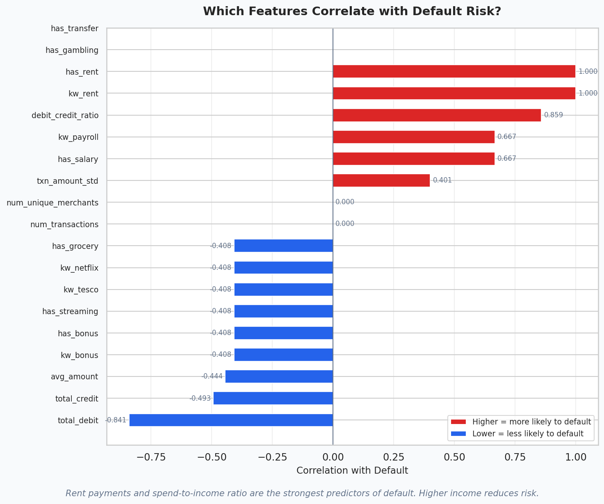
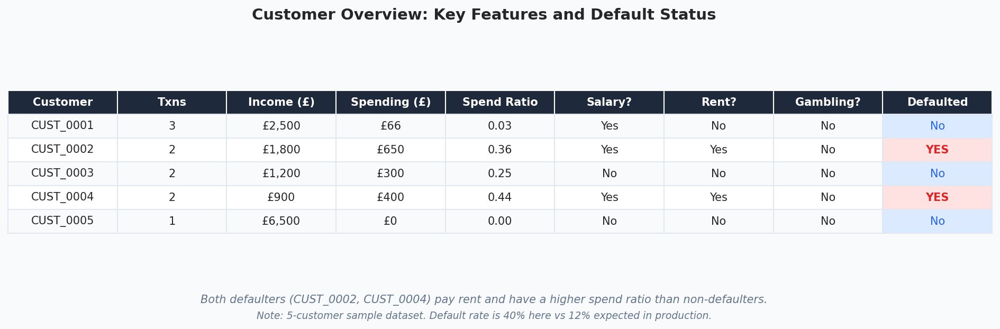

# Credit Risk Prediction Pipeline
 
A data engineering solution that processes raw transaction data and serves credit default predictions via a REST API. Built for the Atto Senior Data Engineer assessment.
 
I really enjoyed this task, it was a good mix of data wrangling, API work, and thinking about production. If I had more time I would have liked to add a Dockerfile and a basic CI pipeline with GitHub Actions so the whole thing could be built, tested, and deployed in one push. I'd also retrain the model using the improved `has_` category features instead of the flat `kw_` keywords, and add a `/predict/batch` endpoint for scoring multiple customers in one call. Maybe even a small Streamlit dashboard so stakeholders could upload a CSV and see predictions without touching the API directly.
 
## Quick Start
 
```bash
git clone <repo-url>
cd atto-credit-risk
 
python3 -m venv venv
source venv/bin/activate
 
pip install -r requirements.txt
 
# Part 1: Run the data pipeline
python -m src.prepare_data
 
# Part 1 (optional): Generate EDA charts
python -m src.eda
 
# Part 2: Start the prediction API
uvicorn src.app:app --port 8000
 
# Run tests
pytest tests/ -v
```
 
Once the API is running, visit http://localhost:8000/docs for the interactive Swagger UI.
**Note:** The pre-trained model was serialised with scikit-learn 1.1.3. Current versions of scikit-learn load it correctly but emit an `InconsistentVersionWarning`. This is expected and does not affect predictions. Pinning to 1.1.x would silence it, but 1.1.x cannot be built on Python 3.12+, so the warning is left in place. 
 
## Pipeline Flow
 

 
## Project Structure
 

 
## Summary of Changes
 
Changes made to the starter code and why:
 
### prepare_data.py
 
| Change | Why | Outcome |
|--------|-----|---------|
| Added null/non-numeric handling on amounts | Production bank feeds can have blanks, currency symbols, or malformed values | Bad rows are caught and dropped before they corrupt aggregations |
| Added duplicate transaction_id check | Feed retries and double imports are common in banking data | Prevents inflated transaction counts and skewed totals |
| Added outlier detection (IQR method) | Extreme amounts could distort averages | 1 outlier flagged (£6,500 bonus), kept because it's legitimate |
| Added data quality report on every run | The brief asks to document issues; silent pipelines hide problems | Every run prints nulls, coverage, outliers, and default rate |
| Added 3 custom features | Brief requires 1-3 beyond the mandatory four | debit_credit_ratio, txn_amount_std, num_unique_merchants |
| Added merchant category flags | Brief asks for category-level text signals, not just flat keywords | has_salary, has_grocery, has_gambling etc. grouped by meaning |
| Dropped all_desc from output | Intermediate text blob is not a model feature | Clean CSV with only usable columns |
| Renamed defaulted_within_90d to defaulted | Brief's expected output uses "defaulted" | Column name matches the specification |
| Renamed txn_count to num_transactions | Brief's expected output uses "num_transactions" | Column name matches the specification |
| Refactored into importable functions | Everything was inside if __name__, making it untestable and not reusable | Functions can now be imported, tested, and called from other modules |
| Fixed IQR outlier detection | Running IQR on mixed debits/credits gives misleading results | Outliers now checked separately on debits and credits |
 
### app.py
 
| Change | Why | Outcome |
|--------|-----|---------|
| Added customer_id to request and response | Brief's example shows it; needed to trace predictions back to customers | Predictions are identifiable |
| Replaced on_event with lifespan | on_event("startup") is deprecated in modern FastAPI | Uses current best practice |
| Added Pydantic Field constraints | Without validation, bad data (e.g. kw_rent=5) reaches the model silently | Invalid inputs rejected with 422 before hitting the model |
| Field names match training_set.csv | API contract must match the pipeline output exactly | Feature names are consistent between Part 1 and Part 2 |
| Added structured logging with latency | No audit trail in the original; can't debug production issues | Every prediction logged with customer, result, and time taken |
| Added PredictionResponse model | Raw dict returns aren't validated or documented | Output contract is enforced; Swagger docs auto-generated |
| Improved health endpoint | Original just returned "ok" even if model failed to load | Load balancers can check if the service is actually ready |
| Added try/except on model prediction | Unhandled model errors would leak stack traces to the caller | Clean error message returned; real error logged internally |
| Aligned API schema with all Part 1 features | API only accepted 9 features but pipeline produces 20 | API now accepts kw_, has_, and custom features; model uses the 9 it needs |
 
## Part 1: Data Engineering
 
### Approach
 
The pipeline in `src/prepare_data.py` follows a straightforward flow: load, explore, clean, engineer features, and save.
 
On loading, it prints a data quality report covering nulls, duplicates, customer coverage between the two files, outlier detection, and the default rate. The sample data turned out to be clean (no nulls, no duplicates), but the checks are there because production data won't be.
 
### Data Quality Findings
 
- No null values across any column
- No duplicate transaction IDs
- 1 amount outlier detected (CUST_0005's £6,500 bonus payment, kept in the dataset as it's legitimate)
- 4 out of 5 customers have fewer than 3 transactions, which means features like standard deviation are less reliable
- Default rate is 40% in the sample vs the 12% mentioned in the brief (expected with only 5 customers)
- All customers in transactions have matching labels and vice versa
 
### Feature Engineering
 
The mandatory four features (num_transactions, total_debit, total_credit, avg_amount) are computed via a groupby aggregation. On top of those I added three custom features:
 
- **debit_credit_ratio**: Total spending divided by total income. Values above 1.0 mean a customer is spending more than they earn. In the sample data, the two defaulters (CUST_0002 at 0.36, CUST_0004 at 0.44) both have higher ratios than non-defaulters.
- **txn_amount_std**: Standard deviation of transaction amounts. Captures spending volatility. Erratic patterns often signal financial distress. Customers with only 1 transaction get a value of 0.
- **num_unique_merchants**: Number of distinct merchants a customer transacts with. A proxy for lifestyle diversity and financial breadth.
 
### Text Processing
 
The original starter code had 5 flat keywords. I kept those (the pre-trained model expects them as `kw_*` features) but added a merchant category system on top. Categories like "grocery", "streaming", "gambling", and "salary" group related merchants together, so adding a new supermarket to the grocery list is a config change, not a code change. This produces `has_*` columns that would replace the `kw_*` columns if we retrained the model.
 
### EDA
 
Three visualisations are generated by `src/eda.py` and saved to `artifacts/`. With only 5 customers these are illustrative rather than statistically significant, but they show the exploratory process I'd follow with a larger dataset.
 
#### Chart 1: Feature Comparison (Defaulters vs Non-Defaulters)
 

 
**Why this chart:** Before building features, you need to see if they actually separate the two groups. This immediately shows that defaulters earn less (total income), spend a higher share of it (spend ratio), and have more volatile amounts. It validates that the custom features we engineered carry real signal.
 
#### Chart 2: Feature Correlation with Default
 

 
**Why this chart:** A correlation bar chart ranks every feature by its relationship with the target. It answers the question "what matters most?" at a glance. Here, rent payments and debit-to-credit ratio are the strongest positive predictors, while higher income (total_credit) is the strongest negative predictor. This would guide feature selection if we retrained the model.
 
#### Chart 3: Customer Summary Table
 

 
**Why this chart:** A reviewer should be able to see the actual data, not just aggregated statistics. This table shows every customer's key metrics with colour-coded default status. You can immediately spot that both defaulters (CUST_0002 and CUST_0004) pay rent and have higher spend ratios. It tells a story in one glance.
 
#### Charts I considered but didn't include
 
- **Histogram of transaction amounts:** Useful with thousands of rows to show distribution shape, but with 10 transactions it would just be 10 bars. Not informative at this scale.
- **Time series of transactions:** The sample data covers only 4 days (Feb 1-4), so there's no meaningful temporal pattern to visualise. With months of data this would be valuable for spotting spending trends before default.
- **Confusion matrix / ROC curve:** These are model evaluation charts, not EDA. The brief asks for feature exploration, not model performance. I'd include these if the task asked for model evaluation.
 
## Part 2: API Development
 
The FastAPI service in `src/app.py` loads the model once at startup and exposes two endpoints:
 
- `GET /health` returns the service status and whether the model loaded successfully
- `POST /predict` accepts all features from the Part 1 pipeline and returns a default probability and binary prediction
 
Example request:
```json
{
  "customer_id": "CUST_0001",
  "num_transactions": 3,
  "total_debit": -65.98,
  "total_credit": 2500.0,
  "avg_amount": 811.34,
  "kw_payroll": 1,
  "kw_tesco": 1,
  "kw_netflix": 1,
  "has_salary": 1,
  "has_grocery": 1,
  "has_streaming": 1,
  "debit_credit_ratio": 0.0264,
  "txn_amount_std": 1462.48,
  "num_unique_merchants": 3
}
```
 
Example response:
```json
{
  "customer_id": "CUST_0001",
  "probability": 0.0,
  "prediction": 0
}
```
 
Key decisions I made on the API:

Note: The pre-trained model produces near-zero probabilities for all customers, including the two known defaulters. This is expected given it was trained on only 5 rows with 9 features. This means there isn't enough data for the logistic regression to learn meaningful coefficients. The API and pipeline are built to work with any retrained model dropped into artifacts/model.joblib.
 
- Used `lifespan` context manager instead of the deprecated `on_event("startup")`
- Added Pydantic `Field` constraints (e.g. `kw_rent` only accepts 0 or 1, `total_credit` must be >= 0) so invalid data is rejected before it reaches the model
- Added a `PredictionResponse` model so the output contract is documented and enforced
- Every prediction is logged with customer_id, probability, prediction, and latency in milliseconds
- Model errors are caught and returned as clean 500 responses without leaking stack traces
- API schema accepts all 19 features from Part 1 (kw_, has_, and custom), but only passes the 9 the current model was trained on. The rest are ready for when the model is retrained.
- 11 tests in `tests/test_api.py` covering health, valid predictions, and input validation (422 on bad data)
 
## Part 3: Discussion
 
### 1. What was most challenging?
 
Getting the feature names right across the three layers: the brief's expected format, the pre-trained model's expectations, and the training set output. The brief shows `has_rent` and `num_transactions`, but the model was trained on `kw_rent` and `txn_count`. I had to keep the `kw_*` columns for backward compatibility with the existing model while also producing the `has_*` category columns the brief describes. In production I'd push for a model retrain so everything aligns.
 
### 2. What tradeoffs did you make?
 
- **Kept outliers rather than removing them.** In financial data, a large transaction is usually real (salary, rent). Removing them would destroy genuine signal. I flagged them instead.
- **Kept the `kw_*` columns alongside the new `has_*` category columns.** This means some redundancy in the training set, but it ensures the pre-trained model still works while showing the improved approach.
- **Prioritised readability over abstraction.** The code is straightforward and well-commented rather than heavily abstracted into classes and modules. For a 5-customer dataset and a 3-4 hour task, this felt like the right call. In production I'd refactor into a proper module structure.
- **Logged outliers but didn't remove them or cap them.** With more data and time, I'd explore winsorisation or log transforms.
 
### 3. Production deployment (Azure, £500/month, <100ms, 1000 predictions/hour)
 
With those constraints, here's how to procede: 
 
**Compute:** Azure Container Apps. It's cheaper than AKS for this traffic level and supports auto-scaling. A single container running the FastAPI app with 1 vCPU and 2GB RAM would handle 1000 predictions/hour easily. Logistic regression inference is microseconds, so the 100ms latency target is met comfortably. Cost would be roughly £30-50/month at this scale.
 
**Model storage:** Azure Blob Storage for the model artifact. The container pulls it on startup. This decouples model updates from code deployments. When the data science team retrains, they upload a new model.joblib and the service picks it up on next restart. Cost is negligible.
 
**Data pipeline:** Azure Functions on a schedule (e.g. daily) to run the feature engineering pipeline, or Azure Data Factory if the pipeline grows more complex. The training set output goes to Blob Storage. Cost around £10-20/month.
 
**Monitoring:** Azure Application Insights for request logging, latency tracking, and error rates. This is where the structured logging in the API pays off. Cost around £20-30/month.
 
**Total estimated cost: ~£100-150/month**, well within the £500 budget. The remaining budget gives headroom for scaling or adding a staging environment.

reference: https://azure.microsoft.com/en-gb/pricing/calculator/
 
### 4. How would you deploy the FastAPI service?
 
1. Write a Dockerfile (Python 3.12 slim image, install requirements, copy src/ and artifacts/, run uvicorn)
2. Build and push to Azure Container Registry
3. Deploy to Azure Container Apps with a health check on `/health`
4. Model artifact stored in Azure Blob Storage, downloaded at container startup
5. CI/CD via GitHub Actions: push to main triggers build, test, and deploy
 
For model updates specifically, I'd version the model files in Blob Storage (e.g. `model_v1.joblib`, `model_v2.joblib`) and use an environment variable to control which version the service loads. This way you can roll back to a previous model without redeploying.
 
### 5. If transaction volume jumped from thousands to millions per day?
 
Pandas breaks down at scale. At millions of transactions per day, I'd rethink Part 1 in a few ways:
 
- **Swap pandas for PySpark or DuckDB.** The aggregation logic (groupby, sum, mean, std) translates directly. DuckDB is a good middle ground since it runs on a single machine but handles much larger datasets than pandas.
- **Partition the data.** Process transactions by date partition rather than loading everything into memory. The pipeline would read today's batch, not the entire history.
- **Move to a proper orchestrator.** Azure Data Factory or Airflow to manage the pipeline, with retry logic, alerting, and data lineage tracking.
- **Pre-compute features incrementally.** Instead of re-aggregating from scratch every time, maintain a running feature store and update it with each new batch. This is much more efficient than full recomputation.
- **Text processing at scale.** The regex-based cleaning is fine for thousands of rows but could be parallelised with Spark UDFs or run through a dedicated NLP service for millions.
 
### 6. What metrics would you track? What could go wrong?
 
**Metrics I'd track:**
 
- **Prediction distribution:** If the model suddenly starts predicting 90% default or 0% default, something has changed. Track the mean and spread of predicted probabilities daily.
- **Feature drift:** Monitor the distributions of input features over time. If the average transaction count drops significantly, the incoming data may have changed shape.
- **Latency (p50, p95, p99):** The 100ms requirement needs monitoring, not just testing. A p95 over 80ms is an early warning.
- **Error rate:** Percentage of requests returning 4xx or 5xx. Spike means something is wrong with either input data quality or the model.
- **Default rate (actual vs predicted):** Once you have ground truth (did the customer actually default after 90 days?), compare it to what the model predicted. This is the ultimate measure of model health.
 
**What could go wrong:**
 
- **Model drift.** The economy changes, customer behaviour shifts, or a new type of fraud appears. The model was trained on historical patterns that may not hold. Regular retraining on fresh data is essential.
- **Data drift.** A new transaction feed starts sending descriptions in a different format. The text processing breaks silently and the `has_*` features all become 0. The model still runs but its predictions are garbage.
- **Class imbalance getting worse.** If the default rate drops from 12% to 2%, the model's threshold of 0.5 becomes wrong. You'd need to recalibrate.
- **Stale model.** If nobody retrains the model for 6 months, it's making decisions on outdated patterns. There should be a scheduled retraining cadence with a holdout validation check before deploying a new version.
- **Adversarial inputs.** In credit, customers or brokers can game the system if they know which features the model looks at. Monitoring for unusual patterns in input data helps catch this.
- **No runbook or on-call documentation.** If the model starts returning bad predictions at 2am, whoever gets paged needs to know how to diagnose it: where the logs are, how to roll back to a previous model version, who owns the retraining pipeline. Without documented incident response procedures, a 10-minute fix becomes a 2-hour outage.
- **Silent infrastructure failures.** The Blob Storage connection times out and the container starts with no model, or the feature pipeline job fails silently and the API serves predictions on stale data. These aren't model problems (they're plumbing problems) but they have the same effect on the customer. Health checks, pipeline alerting, and data freshness checks catch these before they reach production.

### 7. Use of AI tools

I used LLM (mainly Gemini) for double checking the Azure development strategy and cost estimates.

It was most helpful for thinking through production considerations where having a sounding board for architecture decisions saved time. 

I wrote all the final code myself and tested it locally on my machine before submitting.


